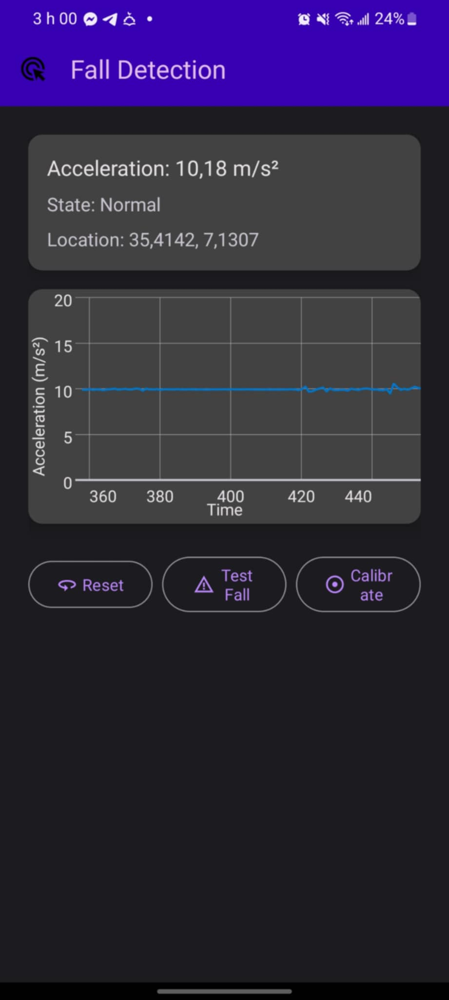
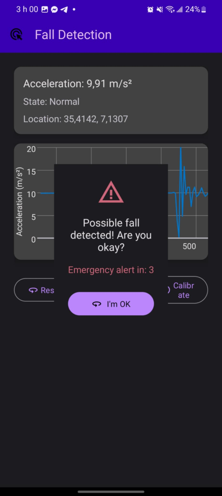

<h1>Fall Detection App</h1>

<h2>📱 Application Overview</h2>

<strong>Fall Detection App</strong> is an Android application that monitors user movements and detects potential falls using the device's accelerometer. When a fall is detected, the app initiates an emergency protocol including a countdown timer and location-based alert system.

<h2>✨ Key Features</h2>
<ul>
  <li>📊 Real-time acceleration monitoring with graphical visualization</li>
  <li>🚨 Advanced fall detection algorithm</li>
  <li>⏱️ Emergency countdown with user cancellation option</li>
  <li>📍 Location tracking for emergency alerts</li>
  <li>🧪 Built-in fall simulation for testing</li>
  <li>🛠️ Calibration mode for personalized sensitivity</li>
</ul>

<h2>🛠️ Technical Implementation</h2>

<h3>System Architecture</h3>
<pre>
Main Components:
- MainActivity: UI and sensor management
- FallDetectionThread: Core detection algorithm
- Material Design 3 UI components
- GraphView for real-time data visualization
</pre>

<h3>Technologies Used</h3>
<ul>
  <li>Android SDK</li>
  <li>Material Design 3</li>
  <li>Google Location Services</li>
  <li>JJoe64 GraphView</li>
  <li>Android Sensor Framework</li>
</ul>

<h2>🚀 Getting Started</h2>

<h3>Prerequisites</h3>
<ul>
  <li>Android Studio (latest version)</li>
  <li>Android device/emulator with API 26+</li>
</ul>

<h3>Installation</h3>
<ol>
  <li>Clone the repository</li>
  <li>Open in Android Studio</li>
  <li>Build and run on device/emulator</li>
</ol>

<h2>📸 Screenshots</h2>

  
  
<strong>Home Screen:</strong> Real-time acceleration graph and emergency options.

  
  
<strong>Alert Screen:</strong> Countdown and location alert trigger.

